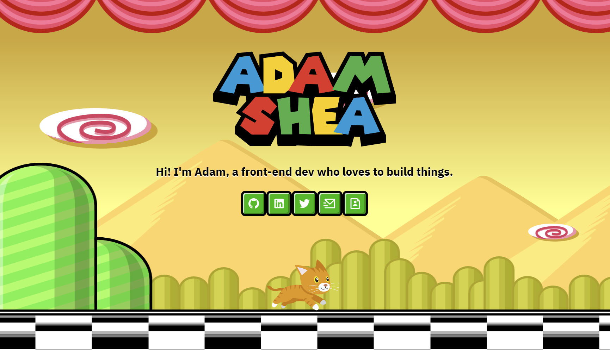

# AdamJS.dev

This is my personal website! It was inspired by a certain video game from the 90's, but since I can't use their character I used a cat instead (of course).

**Link to project:** https://adamjs.dev

## How It's Made:

**Tech used:** NextJS, Stitches, Radix UI

Using NextJS and React for this project is definitely overkill, but I wanted to use something I could scale up if needed, should I decide to add a blog section or portfolio in the future.
At first I built all of the animations out in plain CSS but then converted it all into React components using NextJS and the Stitches CSS in JS framework (which I'm in love with).

I made all of the graphics from scratch in Figma with the exception of the cat sprite.

## Optimizations

I tried handling the parallax animations in two ways -- The first with plain CSS and the second with Framer Motion. Surprisingly, the plain CSS animations seemed to have much better visual and performance results based on testing on my own computer and mobile devices. Even though Framer uses GPU scaling, I found the animations to be significantly smoother using plain CSS and my GPU was using ~15% less running them over Framer.

## Lessons Learned:

This was my first time trying a parallax effect, and was surprised at how easy it is once you have the graphics built out. I'd imagine scroll parallax is more complicated.
I introduced Radix UI components into this project to get more of a handle on accessibility requirements. I utilized their tooltips for the buttons, and also used the `<title>` tag inside the react-icons items to ensure screen reader compatability. I used a screen reader to check the page and all seemed to work well, including having an image set as an H1 which I was hesitant about.
